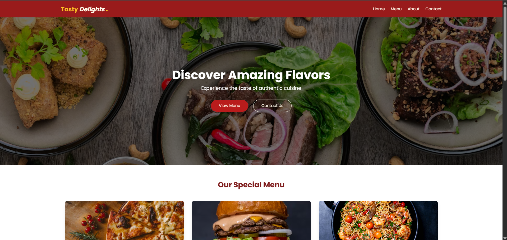
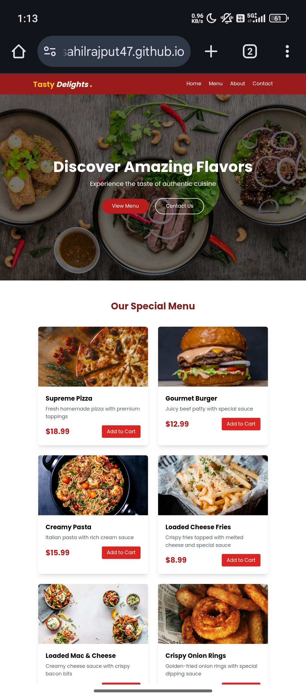

# 🍽️ Tasty Delights.

**Tasty Delight** is a modern and visually appetizing food website crafted using **HTML5**, **CSS3**, **JavaScript**, and **Tailwind CSS**. Designed with a vibrant and energetic theme of **orange**, **red**, and **white**, this project provides an immersive, fast, and responsive user experience—perfect for food enthusiasts and restaurant showcases.


 <!-- Optional: replace with your actual image -->

---

## 🚀 Live Demo

Explore the website live: [Tasty Delight](#)  
_(https://sahilrajput47.github.io/Food-Website/)_

---

## 🎯 Key Features

- 📱 **Responsive Design**: Works beautifully across mobile, tablet, and desktop screens.
- ⚡ **Optimized Performance**: Clean, lightweight code with fast loading times.
- 🧩 **Interactive UI Elements**: Smooth JavaScript-powered interactions.
- 🎨 **Tailwind CSS Styling**: Utility-first approach for rapid and scalable design.
- 🍊 **Vibrant Color Theme**: Eye-catching orange-red-white palette.
- 🍴 **Modern Food Icons**: Integrated stunning icons for rich visual appeal.

---

## 🧰 Tech Stack

| Technology     | Description                                  |
|----------------|----------------------------------------------|
| HTML5          | Semantic and structured markup               |
| CSS3           | Base styling for layout and typography       |
| JavaScript     | Adds interactivity and dynamic behavior      |
| Tailwind CSS   | Utility-first CSS for modern UI/UX design    |

---

## 🗂️ Project Structure (Line-wise)

- `tasty-delight/` – Root project folder  
  ├─ `public/` – Static assets  
  │  ├─ `images/` – Food images, banners, gallery photos  
  │  └─ `icons/` – Icon sets (SVGs, PNGs)  
  ├─ `src/` – Source code files  
  │  ├─ `css/` – Stylesheets  
  │  │  └─ `main.css` – Tailwind and custom styles  
  │  ├─ `js/` – JavaScript files  
  │  │  └─ `app.js` – Main JavaScript for interactivity  
  │  └─ `index.html` – Homepage HTML  
  ├─ `tailwind.config.js` – Tailwind CSS configuration  
  ├─ `postcss.config.js` – PostCSS config (for Tailwind builds)  
  ├─ `package.json` – Project metadata and dependencies (optional)  
  └─ `README.md` – Project documentation


---

## 🖼️ Screenshots

| Mobile View |
|-------------|
 |  |

---

## 🧪 Getting Started

To run the project locally:

```bash
# 1. Clone the repository
git clone https://github.com/SahilRajput47/tasty-delight.git

# 2. Navigate to the project directory
cd tasty-delight

# 3. Open index.html in your browser
start index.html  # Windows
open index.html   # macOS

👨‍💻 Author
Sahil Rajput
Frontend Developer | UI/UX Enthusiast

📧 Email: karanrajput4580@gmail.com

🐙 GitHub: @SahilRajput47

📷 Instagram: @sahil_rajput.74

“Good design is obvious. Great design is transparent.” – Joe Sparano

📄 License
This project is licensed under the MIT License.
You are free to use, modify, and distribute this project with proper credit.

🙌 Feedback & Contributions
Contributions, ideas, and suggestions are welcome!

Fork the repository

Create a new branch (git checkout -b feature/yourFeature)

Commit your changes (git commit -m 'Add your feature')

Push to the branch (git push origin feature/yourFeature)

Open a Pull Request

Thank you for checking out Tasty Delight! 🍱✨

---

✅ **Next Steps:**
- Replace placeholder links/images with your actual files.
- Save this content in a file named `README.md` inside your GitHub repo folder.
- Commit and push to GitHub to display it on your repository page.

Let me know if you need a dark mode update, deployment guide, or SEO setup!
