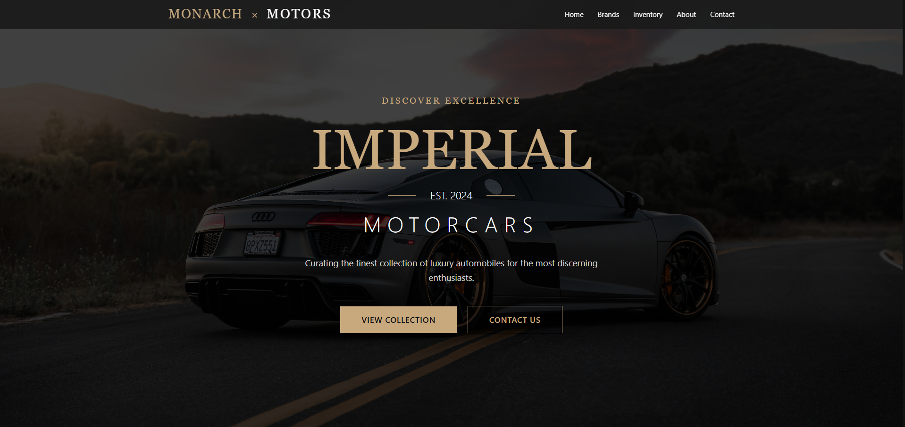
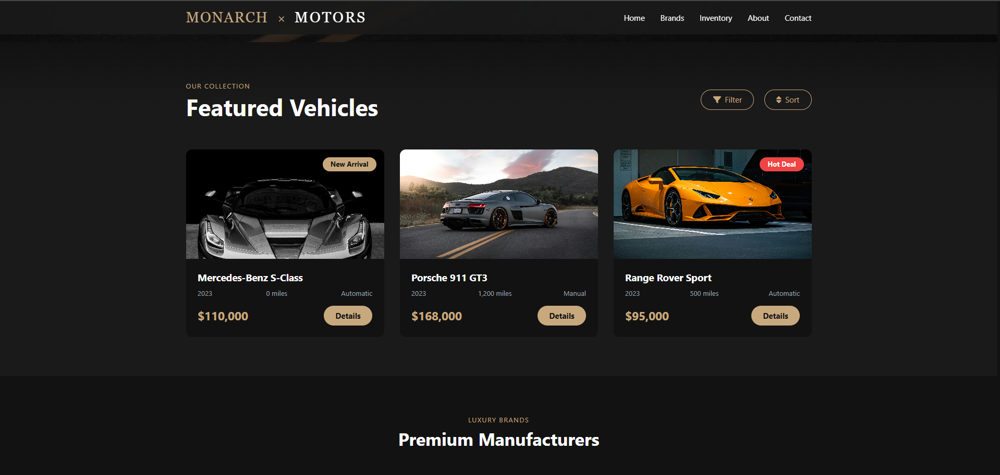
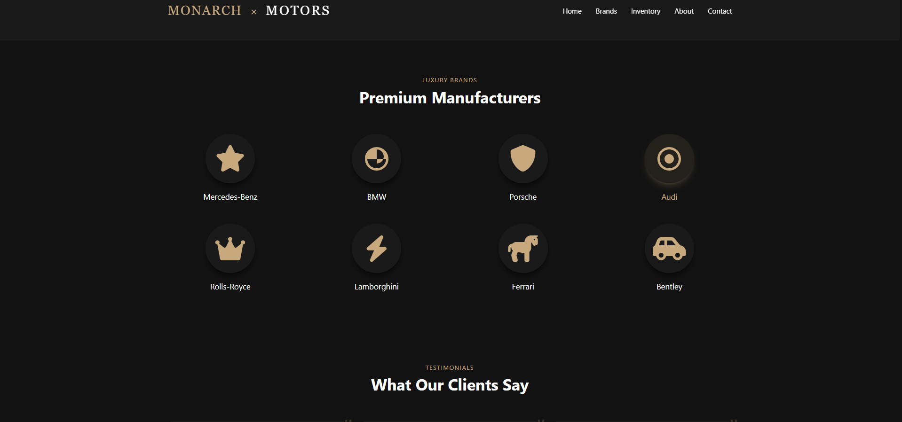
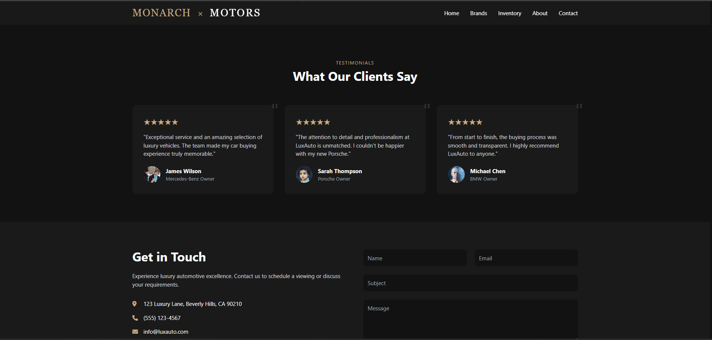
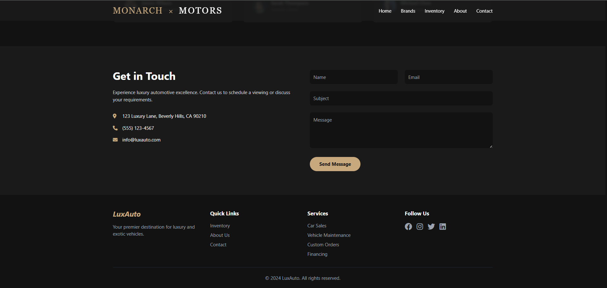

# 🚗 # MONARCH ✨ X MOTORS
| Premium Car Dealership

**LuxAuto** is a modern and high-end car dealership website that redefines the online car-buying experience. Designed with a **bold black and yellow theme**, LuxAuto reflects the elegance and power of luxury cars like **Mercedes, Range Rover, BMW, and Audi**. Built with the latest web technologies like **HTML5**, **Tailwind CSS**, and **JavaScript**, it offers a seamless, stylish, and responsive experience across all devices.

Whether you're showcasing exotic cars, creating a virtual showroom, or building a brand identity for your dealership, LuxAuto delivers performance and polish in every detail.

---

## 🖼️ Website Preview
## 🚀 Live Demo

> 🚀 Live here:(https://sahilrajput47.github.io/Car-Agency/)












---

## 🎯 Features

- 🖤 **Elegant Black & Yellow Theme** — Sleek and premium, perfect for luxury car brands.
- 🚘 **Modern Car Listings** — Highlight top-tier models with rich visuals and details.
- 📱 **Fully Responsive Design** — Optimized for mobile, tablet, and desktop.
- 🔍 **Interactive Filters** — Smart search and filter for easy car browsing.
- 💨 **Fast Load Times** — Lightweight structure with no heavy dependencies.
- 💡 **Icon Integration** — Modern SVG icons from Lucide, Heroicons, or RemixIcon.
- ⚙️ **Clean Codebase** — Easy to read, modify, and scale.

---

## 🛠️ Built With

- **HTML5** – Clean and semantic structure
- **Tailwind CSS** – Utility-first CSS framework for modern styling
- **JavaScript (Vanilla)** – Adds interactivity like filters and toggles
- **Lucide / Heroicons / RemixIcon** – Sleek, lightweight icon libraries

---
## 📁 Project Structure

📁 LuxAuto/

├─ 🏠 index.html — Main HTML file (homepage)

├─ 🎨 css/
│ └─ styles.css — Tailwind + custom styles

├─ ⚙️ js/
│ └─ main.js — JavaScript for interactivity

├─ 🖼️ assets/
│ ├─ 🖼️ images/
│ │ ├─ preview.png — Website screenshot for README
│ │ ├─ car1.jpg — Example car image
│ │ ├─ car2.jpg — Another car image
│ │ └─ logo.png — Brand logo
│ │
│ └─ 🔣 icons/
│   ├─ mercedes.svg — Mercedes icon
│   ├─ range-rover.svg — Range Rover icon
│   └─ bmw.svg — BMW icon

├─ 📘 README.md — Project documentation

├─ 📄 LICENSE — MIT License file (optional)

└─ 🚫 .gitignore — Git ignore rules

## 🚀 Getting Started

1. **Clone the repo:**

```bash
git clone https://github.com/SahilRjput47/LuxAuto.git
cd LuxAuto

🔧 Customization Tips
Colors: You can adjust Tailwind utility classes like bg-yellow-500, text-yellow-400, bg-black, etc.

Fonts: Consider using Google Fonts for a unique touch.

Icons: Swap out or customize with any SVG library or CDN.

📩 Contact & Socials
📧 Email: karanrajput4580@gmail.com

📷 Instagram: @sahil_rajput.74

💻 GitHub: @SahilRjput47

🌟 Future Enhancements
✅ Backend integration (Firebase or Express.js)

✅ Booking/reservation system

✅ Testimonials & reviews section

✅ Payment gateway integration

✅ Admin dashboard for inventory control

📝 License
This project is open source under the MIT License. Feel free to use, modify, and share.

🚧 Note: This is a frontend-only template. Backend/database features are not yet implemented.

Let me know if you want me to include a license file (`LICENSE`), a contribution section, or instructions to deploy this on GitHub Pages or Netlify.
